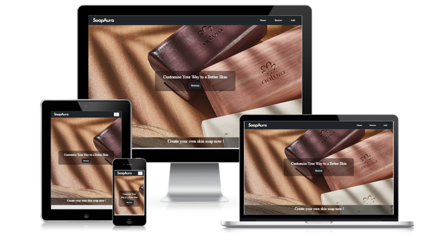
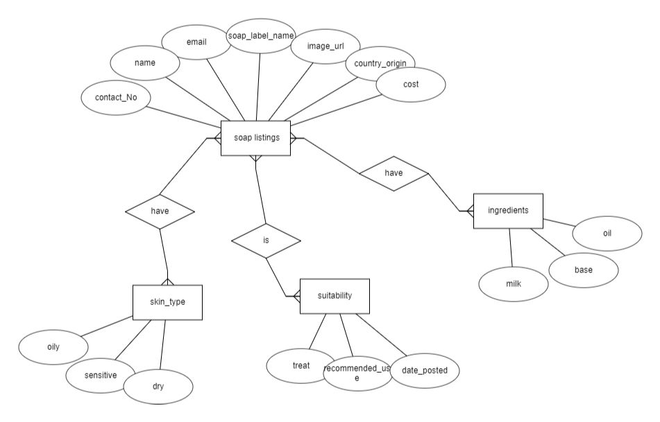
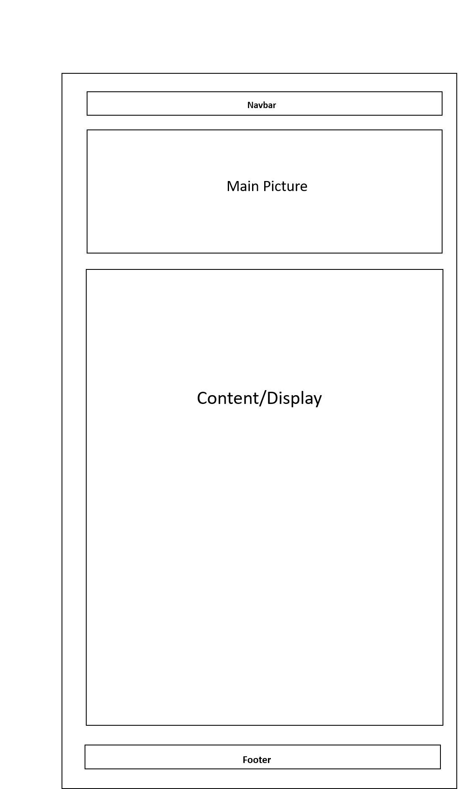

# tgc-18-project-2-SoapAura

- Objective: Allowing users to source for a collection of customise bar soap to suit different skin conditions

* A brief layout of project work in different screen version

### References

- For more details of github frontend react interface please click [here](https://github.com/xunne899/tgc-18-project-2-react)

- For more details of github backend database please click [here](https://github.com/xunne899/tgc-18-project-2-express)

# Content

1. Summary of project
2. UX/UI
3. Features
4. User Stories
5. Technologies Used
6. Test Cases
7. Live Deployment
8. Credits and Acknowledgement

## 1. Summary

- Users with skin conditions need suitable soap to prevent further skin complications. Not many soap products in the market allows user to customise their bar soap
- As a owner of this project i would like to come up with an idea to allow users to create customise bar soap. Also, to source for suitable soap online catering to their skin conditions

### ERD

## 2. UI/UX

### 2.1 Scope

The purpose of this project is to let public, mainly young adults (21 years) to senior citizen(65 years) to be aware that there is a site online which allows them to customise their bar soap. Allowing user's to use the customise bar soap with ease, prior to their skin conditions

### 2.2 Strategy

- Create a webpage to allow bar soap user's to customise bar soap for different skin types and purchase from
  webpage
- Inform users about the customise bar soap recommended usage and treatment for different type's of skin

- Allowing users to add, edit,update and delete the collection of customise soap bar online

#### 2.2.a. User Goals

- Targeted Audience: Young adults from age 21 to Senior Citizens 65 yers old
- Users are able to find their desired customise bar soap online to suit their skin conditions
- Users are able to interect with the seller via contact information posted onliine(contact number, email, name)
- Users are able to obtain ingredients information of the soap product they are purchasing

#### 2.2.b. Organisation's Goals

- Able to provide relevant collection of customise bar soap for different types of skin. Also allowing users to interact with seller of customise soap. Users are able to add modify delete the collection posted online.

### 2.3 Structure

Users are able to access to various applications through the navigation bar. The image below shows a flowchart of how different features can be accessed.

 

### 2.4 Skeleton

Webpage consists of simple 3 components

- Navbar
- Body - Main picture, Display content
- Footer

Navbar is located at the top of webpage. 
Navbar consists of logo and name hyperlinks to respective pages. 
Body consists of the Main picture, Display content, Collection link, Add Item link, Browse Search item link  
Footer at the bottom page with copyright and font aswesome logo. 

### 2.5 Surface

#### 2.5.a Background 

- Background Colors: Black and white color to promote a clean neat look which enable collection cards to stand out 
- Button Colors : Black, Red 

#### 2.5.b Typography 

- Font Color : black and white in general / red color for delete modal page
- Font Family: League Spartan;
- Font Size : 0.6 - 1 rem, h1 to h5 to match with background settings

#### 2.5.c Images 

- Images : Use soap images for the main page
- Website is able to view in mobile size (XS) and for large display like desktop

#### 2.5.c Icons 

- Different icons are used to differentiate the types of page
- Icons colour : Mainly black and white to show a color contrast

## 3. Features 

| Features        | Descriptions                                                                                                                                                  |
| --------------- | ------------------------------------------------------------------------------------------------------------------------------------------------------------- |
| Home            | Main page consist of links to browse, collection and add page                                                                                                 |
| Browse          | Users able to browse search soap collection available.                                                                                                        |
| Search for soap | Users can input field details to search for soap(e.g., skin type, color,ingredients, country).                                                                |
| Search Results  | Users able to edit, delete, post comments for a particular soap collection.                                                                                   |
| Collections     | Users can view the particular soap collection on the main collection page and click to view more details,edit, delete and post comments about the collection. |
| Add             | Users can add a new customise soap and may sell it online.                                                                                                    |

## 4. User Stories

1. As a user i would like to know ingredients of customise soap that will be beneficial for my skin 
2. As a user i would like to know the recommended usage of customise soap bar for types of skin 
3. As a user i would like to know the details of the seller, so that i am able to connect with seller to purchase the soap for my skin type

### 4.1 Acceptance criteria

1. Webpage allows user's to search for soap bar suitable for their skin type area and able to view the details of the seller and communicate with them 
2. Project Webpage is able to enable users to know ingredient content of the customise soap, allows user to edit or update the collection of the soap.

## 5. Technologies Used

- HTML - styling, font size,form size, color
- CSS - styling, font size,form size, color
- React- frontend programming
- Axios - importing data, posting data, HTTP client to endpoint
- MongoDB - backend database
- Express Node JS- Backend programming
- MongoDB Node Driver
- CORS
- doteenv
- Bootstrap - styling, sizing, aligning content, match its mobile responsiveness
- React Boostrap 5.0 - accordian, cards ,modal, forms, col, rows
- Canva - creating logo brand
- CSS loaders - loading logo for browse and collection page
- SweetAlert2 - alert box for successfully deleted and added
- Netlify - hosting my webpage project
- Heroku - hosting backend project
- createmockup - readme file, sample of different view layout
- Github & Gitpod - storing respositories/project

## 6. Testing

### Test Cases

#### PDF

- Test case for each feature and its functionality can be found [here](./test_case.pdf).
- Please download the file for better view

#### Excel

- Test case for each feature and its functionality can be found [here](./test_case.xlsx).
- Please download the file for better view

### Mobile Responsiveness

Responsiveness testing was done on Small handphones SE, Tablet, General Desktop and Laptop size.

## 7. Live Deployment

- Deployment is through Netlify for react frontend 
  Link of live Netlify deployment can be found [here](https://main--project2-soapaura.netlify.app)
- Deployment is through heroku for backend database 
  Link of live HEROKU deployment can be found [here](https://project-2-soap.herokuapp.com/)

## 8. Credits and Acknowledgement

### Credits to:

#### Web Source

[Natura](https://www.naturabrasil.com/)(Home background image) 
[Cathrynviolet](https://cathrynviolet.com/)(Add page background image) 
[Flaticon](https://www.flaticon.com/)(home page, delete icons for my project) 
[Bootstrap](https://getbootstrap.com/docs/5.0/getting-started/introduction/)( features, listgroups,web features)  
[color-hex.com](https://www.color-hex.com/color/)(background color scheme png in readme file) 
[fontawesome.com](https://fontawesome.com/v5/icons/)(use of twitter, whatsapp, facebook, instagram icon for footer) 
[Canva](https://www.canva.com)(creating logo brand) 
[CSS loaders](https://cssloaders.github.io/)(loading logo for browse and collection page) 
[SweetAlert2](https://sweetalert2.github.io/)(alert box for successfully deleted and added) 
[React Bootstrap 5.0](https://react-bootstrap.github.io/)(accordian, cards ,modal) 
[createmockup](https://www.createmockup.com/generate/)(readme file desktop view layout)

#### Mentors

- Guidance from Paul Chor(Head Instructor)
- Guidance from All Teaching Assistants
- Guidance from Batch 18 Trent Global Coursemates
