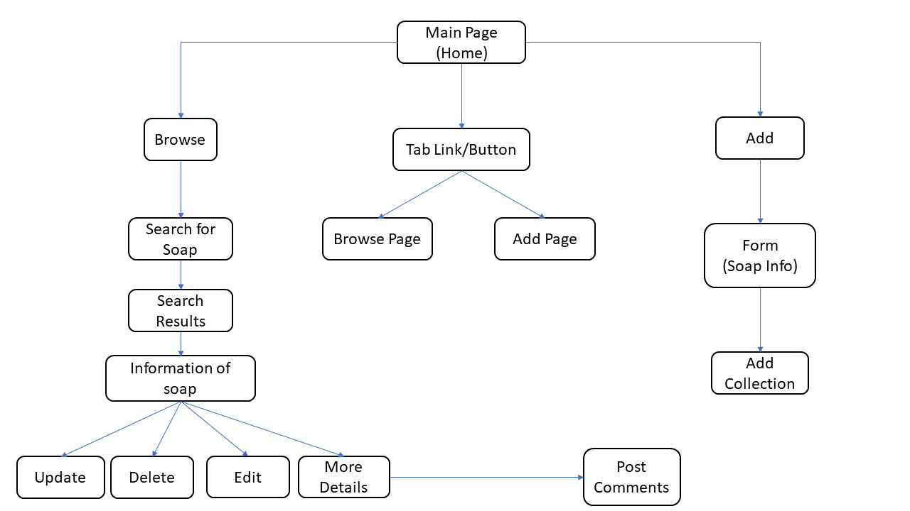

# tgc-18-project-2-SoapAura
<!-- * A brief layout of project work in different screen version -->
* Objective: Allowing users to source for  a collection of customise bar soap to suit different skin conditions

<!--  -->

# Content
1. Summary of project
2. UX/UI 
3. Features 
4. User Stories
5. Technologies Used
6. Testing 
7. Test Cases
8. Deployment
9. Live Link
10. Credits and Acknowledgement

## 1. Summary
*  Users with skin conditions need suitable soap to prevent further skin complications. Not many soap products in the market allows user to customise their bar soap 
* As a owner of this project i would like to come up with an idea to allow users to create customise bar soap. Also, to source for suitable soap online cater to their skin conditions 

### ERD

## 2. UI/UX

### 2.1 Scope
The purpose of this project is to let public, mainly young adults (21 years) to senior citizen(65 years) to be aware that there is a site online which allows them to customise their bar soap. Allowing user's to use the customise bar soap with ease, prior to their skin conditions

### 2.2 Strategy 
* Create a webpage to allow bar soap user's to customise bar soap for different skin types  and purchase from
webpage
* Inform users about the customise bar soap recommended usage and treatment for different type's of skin

* Allowing users to add, edit delete the collection of customise soap bar online

#### 2.2.a. User Goals
* Targeted Audience: Young adults from age 21 to Senior Citizens 65 yers old
* Users are able to find their desired customised bar soap online to suit their skin conditions
* Users are able to interect with the seller via contact information posted onliine(contact number, email, name)
* Users are able to obtain ingredients information of the soap product they are purchasing  

#### 2.2.b. Organisation's Goals
* Able to provide relevant collection of customise bar soap for different types of skin. Also allowing users to interact with seller of customise soap. Users are able to add modify delete the collection posted online.

### 2.3 Structure
  User are able to access to various applications through the  navigation bar. The image below shows a flowchart of how different features can be accessed.

 

### 2.4 Skeleton
Webpage consists of simple 3 components
* Navbar
* Body - Main picture, Display content
* Footer

Navbar is located at the top of webpage. 
Navbar consists of logo and name hyperlinks to respective pages. 
Body  consists of the  Main picture, Display content, Collection link, Add Item link, Browse Search item link  
Footer at the bottom page with copyright and font aswesome logo. 

### 2.5 Surface 

#### 2.5.a Background 
* Background Colors: Dark shade of cyan-blue, white and Light grayish orange to promote a premium classy feel 
* Button Colors : Black, Light grayish orange, white 

#### 2.5.b Typography 

* Font Color :dark shade of cyan-blue/ light grayish orange/ white to blend with the background color
* Font Family: League Spartan;
* Font Size : 0.6 - 1 rem, h1,h2 to match with background settings

#### 2.5.c Images 
* Images : Use soap images for the main page 
* Website is able to view in mobile size (XS) and for large display like desktop

#### 2.5.c Icons 
* Different png icons are used to differentiate the types of bins
* Icons colour : Mainly bright colors (etc. yellow, green, blue) to stand out from the map

## 3. Features 
Features | Descriptions
-------- | -------------
Browse | Users able to browse search soap collection available for sale.
Search for soap| Users can input the details to search for soap(e.g., skin type, colour,ingredients, country).
Search Results | Users able to edit or delete the particular collection of soap posted.
Collections | Users can view  the particular soap collection on the main collection page  and click to view more details about the collection.
Add | Users can add a new customise soap and may sell it online.

  
  
## 4. User Stories
1. As a user i would like to know ingredients of customise soap that will be beneficial for my skin 
2. As a user i would like to know the  recommended usage of the customise soap bar for types of skin 
3. As a user i would like to know the details of the seller, so that i am able to connect with seller to purchase the soap for my skin type 

### 4.1 Acceptance criteria
1. Webpage allows user's to search for soap bar suitable for  their skin type area and able to view the details of the seller and communicate with them 
2. Project Webpage is able to enable users to know ingredient content of the customise soap, allows user to edit or update the collection of the soap.

## 5. Technologies Used
* HTML
* CSS
* React
* Axios - importing data from json file 
* MongoDB - backend database
* Express Node JS- Backend programming
* [Bootstrap](https://getbootstrap.com/docs/5.0/getting-started/introduction/) aligning content, match its mobile responsiveness,
* [Canva](https://www.canva.com) creating logo brand

